# Phony
A Simple Arabic WPF (MVVM) Mobile Store Management Application
For more information about the Application, please see 
https://shababco.blogspot.com/ 

## The Application uses:
	1- LiteDB https://github.com/mbdavid/LiteDB
	2- MahApps https://github.com/MahApps/MahApps.Metro
	3- MaterialDesignInXamlToolkit https://github.com/ButchersBoy/MaterialDesignInXamlToolkit
	4- Modified version of MaterialMessageBox https://github.com/denpalrius/Material-Message-Box
	5- Modified version of BarcodeLib https://github.com/barnhill/barcodelib
	6- WPF Simple Color Picker With Preview https://goo.gl/hL3nra
	7- Crystal Reports https://goo.gl/NCE3SQ
	8- Newtonsoft.Json https://github.com/JamesNK/Newtonsoft.Json
	9- SimpleChildWindow https://github.com/punker76/MahApps.Metro.SimpleChildWindow

## NOTE:
	1- You must install dot Netframework 4.7.1 or later.
	2- Crystal Reports 13 SP 22 or later to have working reports (Optional)

## Screenshots

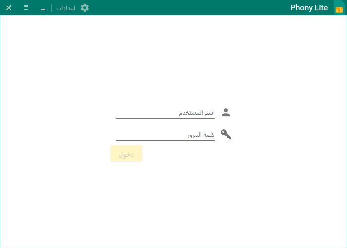

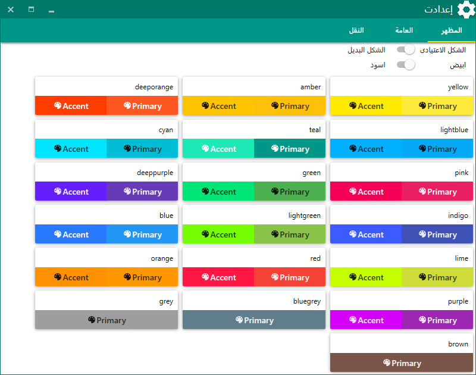

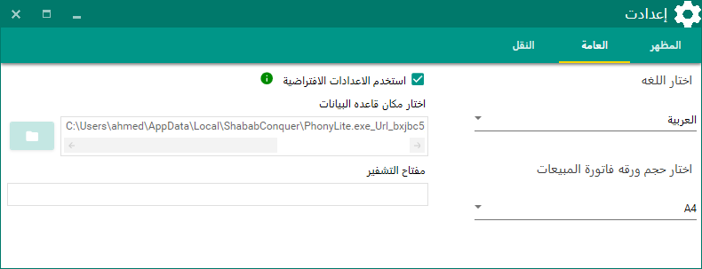

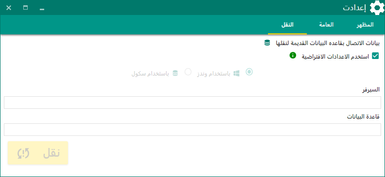

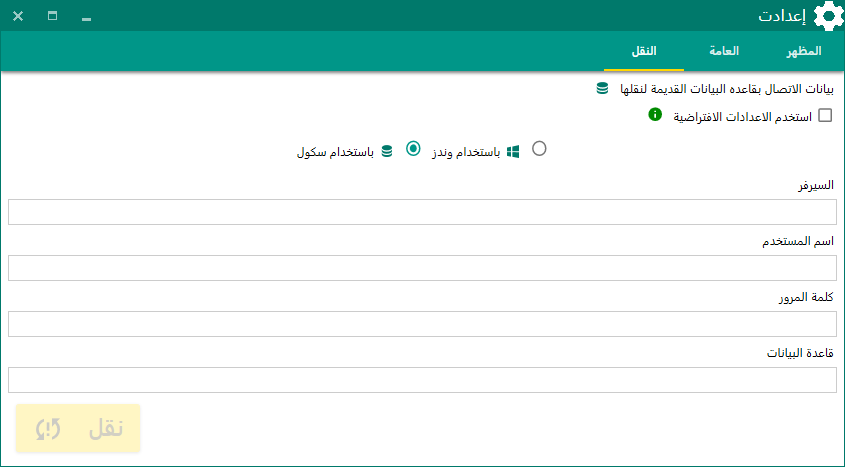

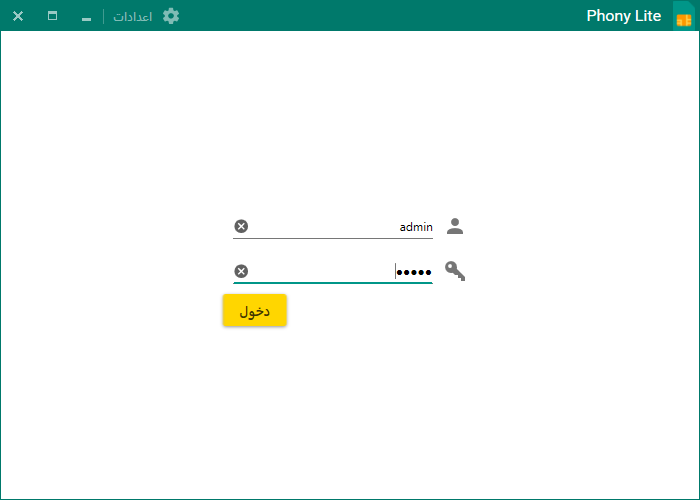

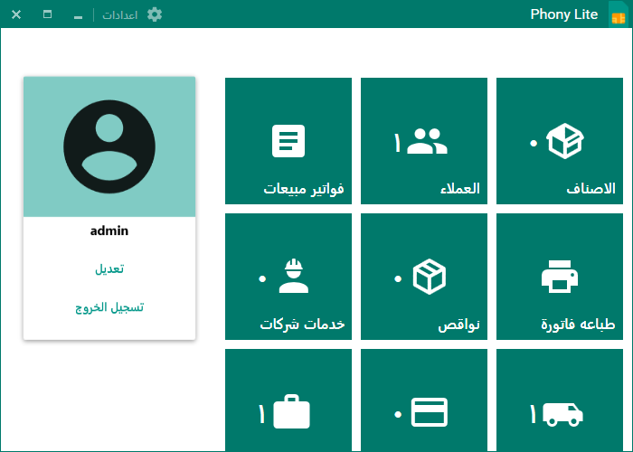

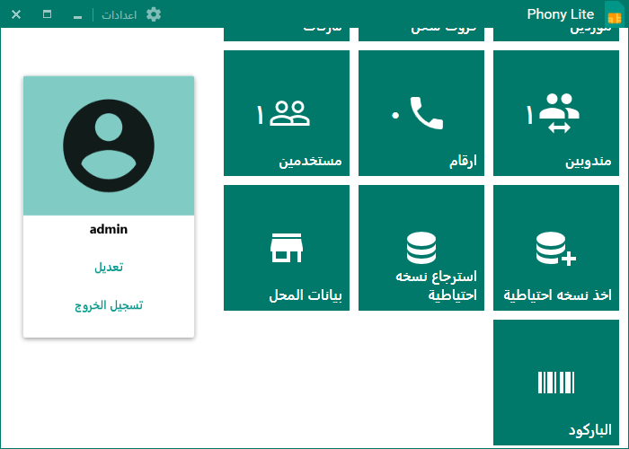

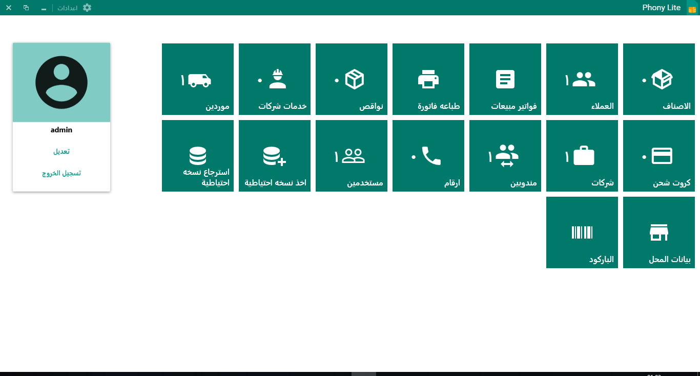

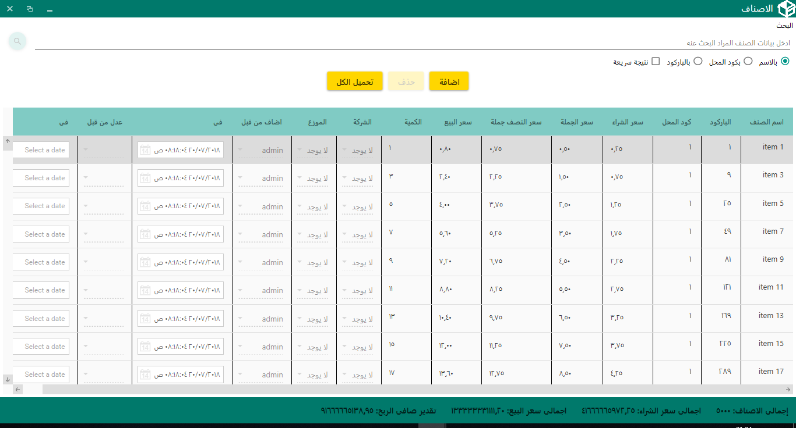

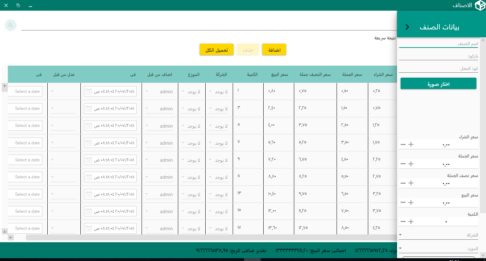

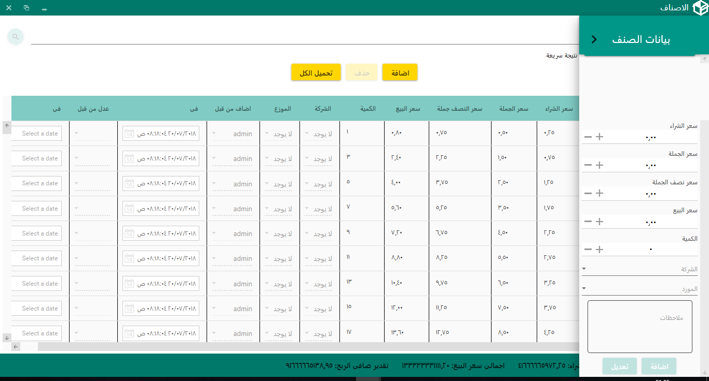

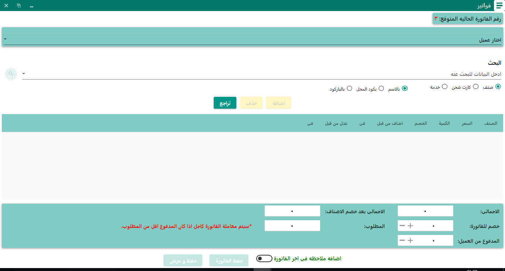

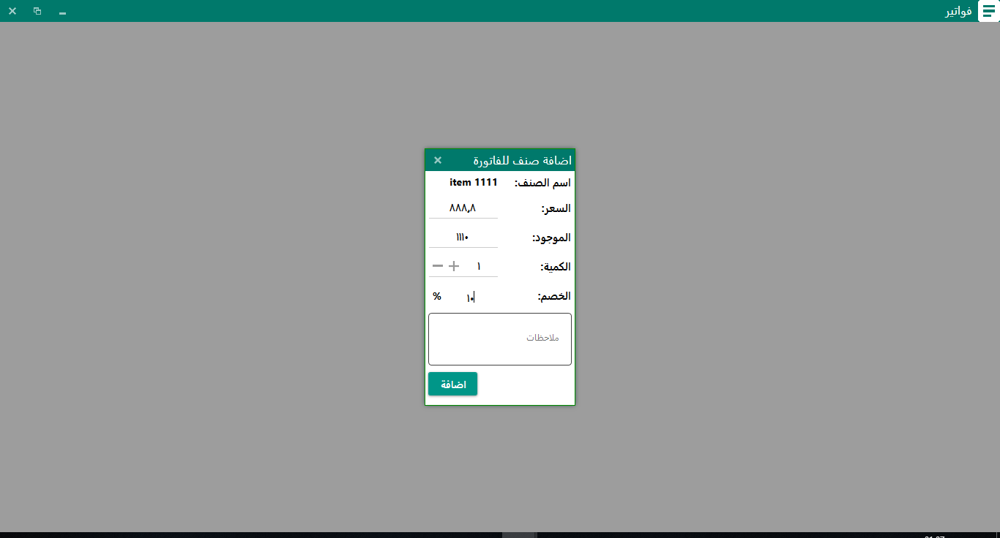

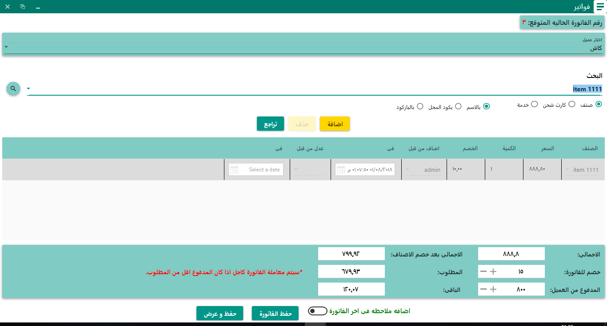

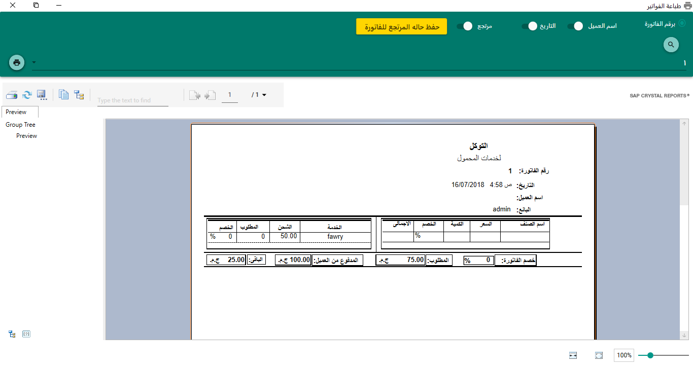

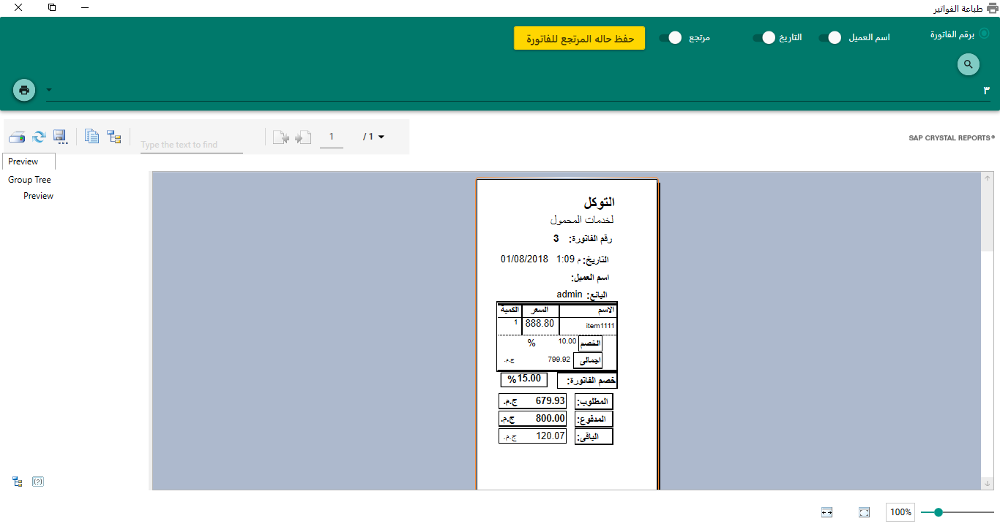

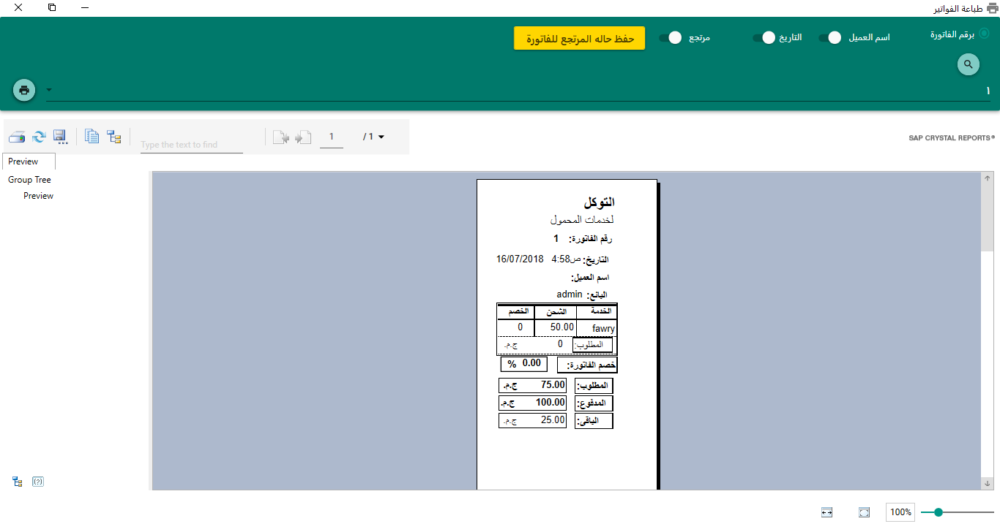

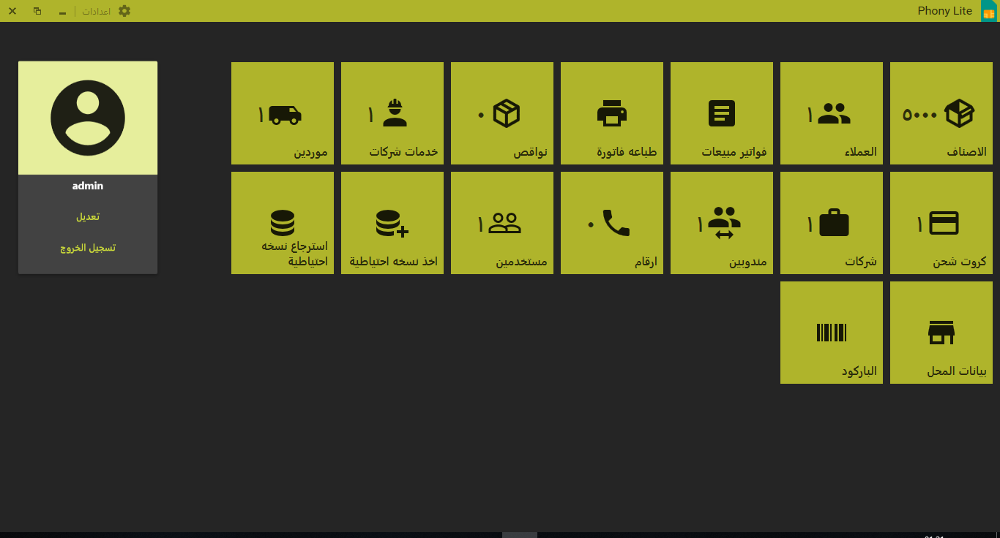

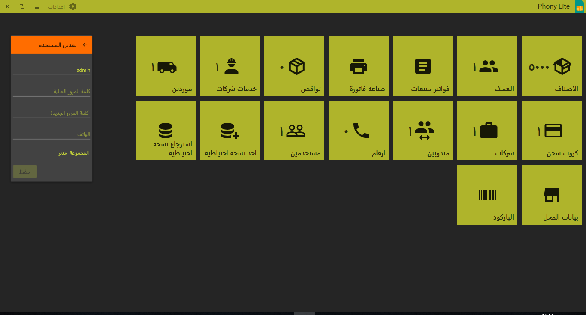

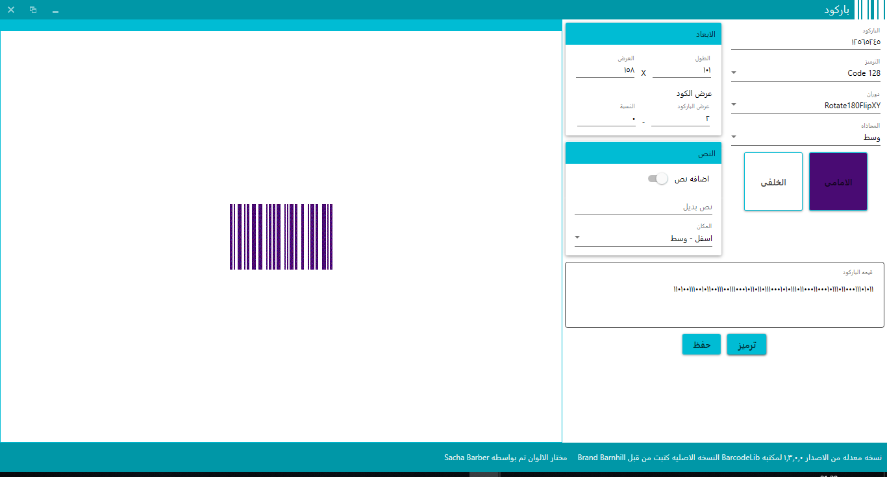